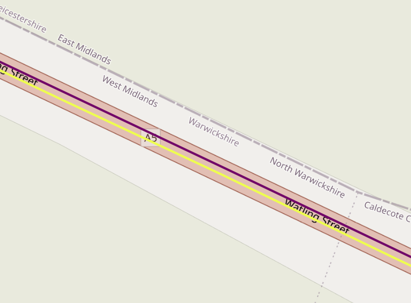
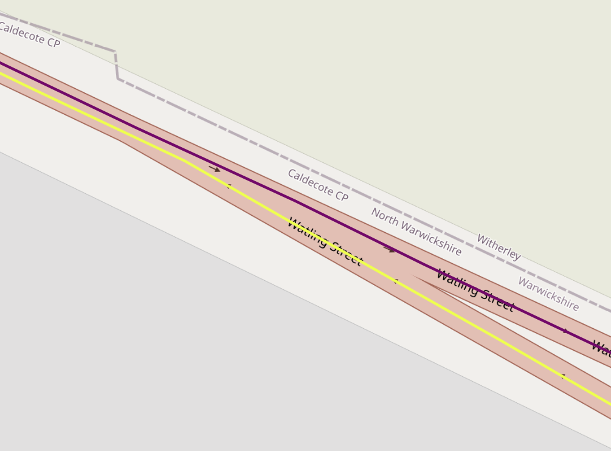
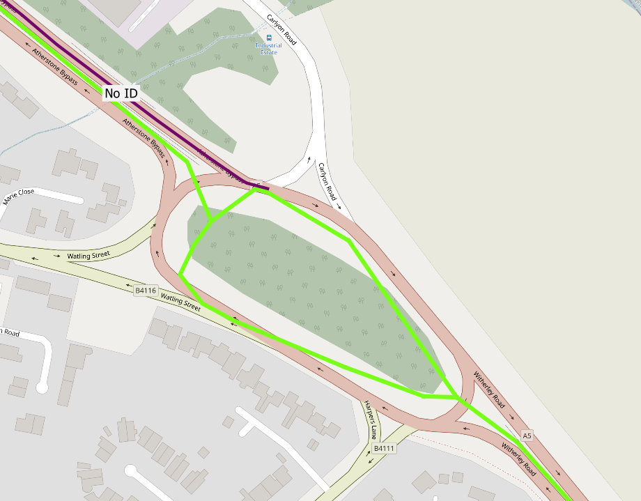
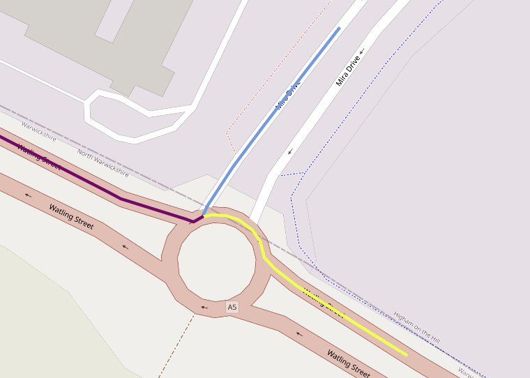

## Pre-face
- The CAV Test Bed currently comprises of two routes (M1 and M3) split into smaller sections, denoted as scenes
- M3 scenes are to be deteremined
- M1 scenes are to be updated

For more technical aspects, see [[QGIS Specific Work]]

---

## Project Objectives
We are tasked with defining M3 scenes. This includes:
- Splitting the M3 centre-line route into M3 scenes, fit for the Data Hub
- Populate M3 scenes with the new updated list of static attributes
- Populate and plan to populate M3 scenes with dynamic attributes

The first task boils down to traversing through Google Maps Street View to find POIs to stop/start scenes at and manually tracing a scene on QGIS
- There is a QGIS plugin to trace out routes using various GPS technologies (TomTom, HERE) however, the traces still require manual editing. Thus, it is more efficient to manually trace the scenes - but this decision is down to the editor
- We have been provided access to the Vaisala Road AI - however, this works for the M1 route and ultimately provides a similar experience to Street View (for the creation of scene geometry, at least)

---
## Best practices
> Scenes are used as a reference/guide visual and thus do not need to be picture-perfect. As long as the scene follows the road, preferably making a distinction to the side of the road in the case of single carriageways, the scene is of use on the Data Hub. Care should be taken where required as this will reduce maintenance of scenes in the future.

> Scenes will be created using lines. It would be ideal to generate curved roads, and thus have the ability to determine [[Road Curvature]], however, this can be solved at a later date. Priority should be given to drawing scenes. Creating splines and curves is finicky with plugins tested thus far.

### Quick GIS Notes
The best practice to aim for when generating scenes is to follow the centre line of the road (using arrows on the OSM map to help) as best possible at a reasonable scale level.
- At lower scales, the map can show small changes in the road which could cause an off-center line; which wouldn't have been picked up at higher zoom levels.
- It is, however, not necessary to be merticulous with the position of the lines - or the spacing between points - as the traces are still very presentable when viewed on the Data Hub and more than fit their purpose, even without pinpoint precision.
- There is room to balance the level of accuracy and the time taken to create and maintain scenes.
- It is worth zooming to around a sub-1000 scale every so often in when tackling meandering sections of road

>To find out which row corresponds to which scene on the map:
>- select row -> view row on map
>- enable labelling of `scene_id` attribute -> view scene ids on map

### Scene Creation Methodology

The current methodology of splitting scenes follows the guidance of M1 scene creation. This is in order to maintain commonality among all scenes. Any changes will then be made to both M1 and M3 routes.

- M1 scenes were split by focussing on the location of speed signs
- M3 scenes will also focus on the location of speed signs, for an initial draft
	- Scenes do not have to stop at speed signs and speed signs can be skipped if the speed does not change / the scene does not have a lot 'going on' / the scene is too short
	- Scenes should stop at speed changes - at the relevant points of signage
	- A `speed_change` attribute will be used to denote scenes either side of a change in speed
- Consideration should also be given to other road assets when deciding on the size of a scene
	- For example, a small scene may be made if it contains a traffic calming measure and multiple roadsigns, whilst being adjacent to a speed change and roundabout entrance
	- Or, a scene may end at a busy junction as the route crosses all four paths of the junction
- Ultimately, the goal is to offer a scene which contains enough POIs (i.e., turnings into other roads, signs, islands, road markings, etc.); ensuring:
	- there are not a high number of short scenes (<600m);
	- and scenes only exceed high lengths (>1800m) when the density of POIs is low

### Single and Dual Carriageways

As the scenes will be present on both sides of the road, the aim is to draw signs slightly to the side of the road the current lane would sit: 

On dual carriageways, the aim is to place the scene more central to the road:

### Handling roundabouts
This is not a fixed requirement and a roundabout may be treating as a piece of infrastructure within a scene rather than the bounds of a scene

## Validation Tasks

After a first draft of all scene geometries is complete, the following should be considered for validation:
> Check for duplicate coordinate pairs (points) for each scene and remove
> Make the last point of a scene equal to the
> Check for scenes with small distances and whether it is worth merging these with adjacent scenes, or not
